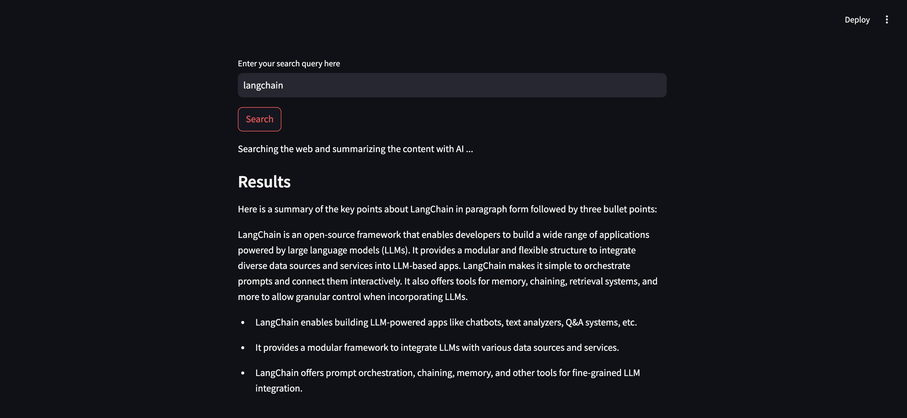

# WebSearch Demo (AI Agent + Streamlit)


## Requirements
- Run the following command to install required packages
```bach
pip install -r requirements.txt
```

## Environment variables setup:
- Create the .env file that contains the following variables:
```bash
CREDENTIALS_PROFILE_NAME= "aws_profile_name"

```
- Load them via the following code:
```python
from dotenv import load_dotenv

load_dotenv()                   # Loading environment variables from .env file
```
## Demo


